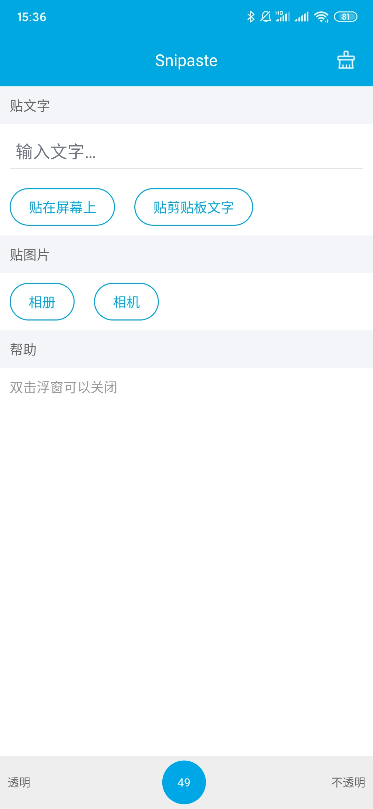
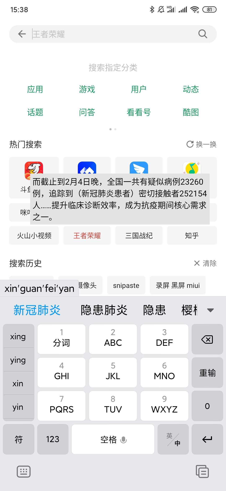
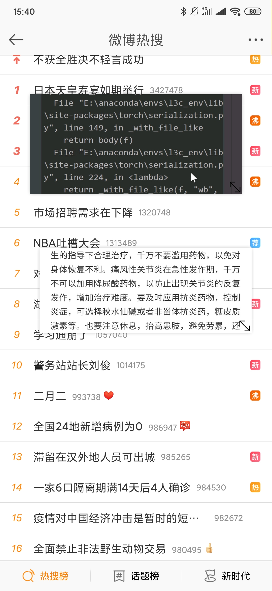

# Snipaste-Android
[中文版本](./README.cn.md)

The screenshot and texture tools commonly used on the computer, but have no Android version, so I learned some basic Android development and wrote one. (Non `snipaste` official)

## Features
At present, there are functions for pasting text and pictures.

### Post text

- Enter text to generate floating window

- Clipboard text generates floating window

### Post pictures

- Floating window for album picture generation

- Generate floating window for taking pictures

- Crop image in front of floating window

### Others
- Transparency adjustment function

- Double-click to close the floating window

- Support multiple floating windows

## screenshot

## Download
Has been renamed Kuan: [click here] (https://www.coolapk.com/apk/255872)

## todo
- [ ] Area screenshot
- [ ] Post a video
- [ ] Other video software is cast to the floating window, so that software without small window function can use the small window playback function.

## Dependence
- [QMUI](https://github.com/Tencent/QMUI_Android), the interface uses this
- [Easy_Float](https://github.com/princekin-f/EasyFloat), the core of the floating window
- [fluid-slider](https://github.com/Ramotion/fluid-slider-android) Liquid slider at the bottom